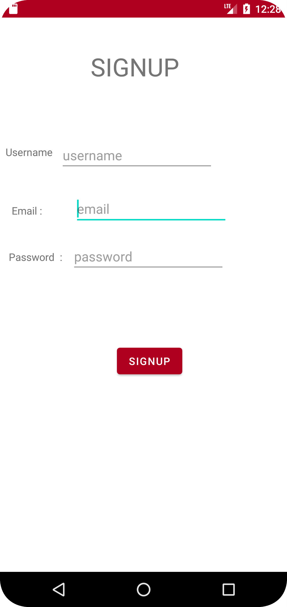
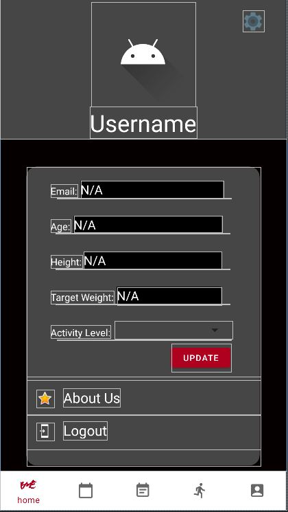
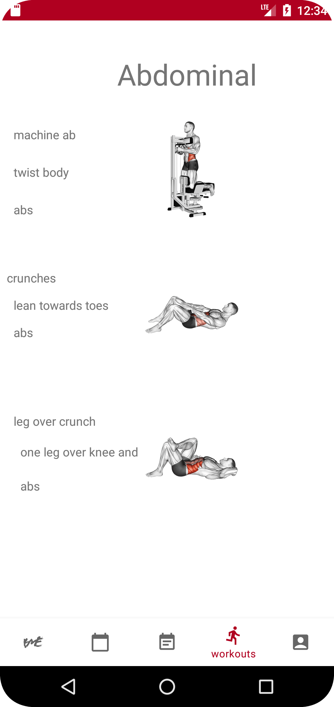
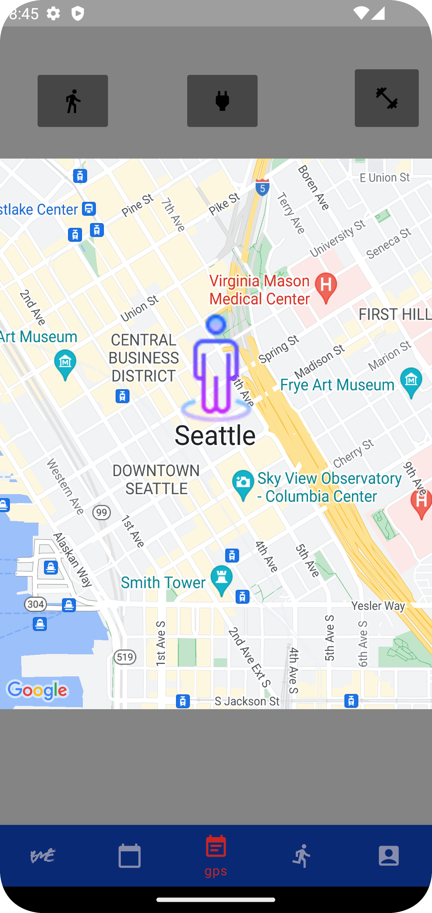
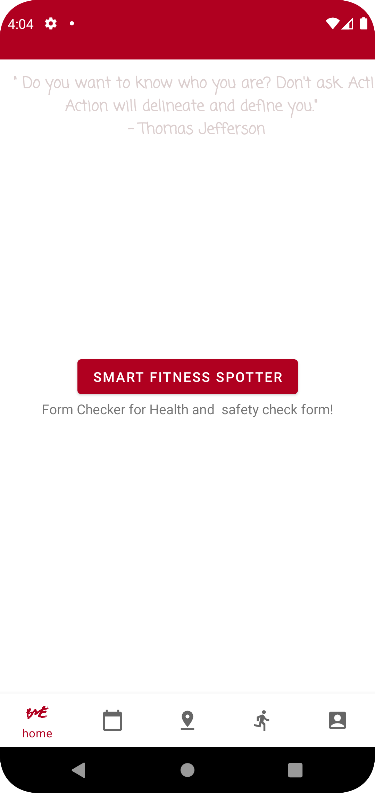

# The BetterMe App 

  

## Project Summary

BetterMe gives new and regular gym users a place to record their BMI and display a history log that shows a workout streak Mon-Fri.

It also provides its users with motivational quotes to keep them fired up and ready to train.

## Requirements

See [REQUIREMENTS](./REQUIREMENTS.md)

## Instructions
- [Follow these instructions to set up AWS, Google API](app/README.md)

## App Features

<figure style="display: flex; flex-direction: row; flex-wrap:wrap; justify-content: space-between">
    <figcaption>
      
</figcaption>
    <figcaption>
      
</figcaption>
    <figcaption>
      
</figcaption>
    <figcaption>
      
</figcaption>
    <figcaption>
      
</figcaption>
    <figcaption>
      
</figcaption>
</figure>

## The Team

Roger Reyes [GitHub](https://github.com/RogerMReyes)

Raul Zarate [GitHub](https://github.com/zaratr)

Abdulahi Mohamud [GitHub](https://github.com/AbdulahiMohamud)

Jason Wilson [GitHub](https://github.com/WilsonJhub)

Mike Brunette [GitHub](https://github.com/mcbrunette33) 

Scott Evans [GitHub](https://github.com/mScottEvans)

Chuck Altopiedi [GitHub](https://github.com/ChuckAlto)

Jon Rumsey [GitHub](https://github.com/nojronatron)

## Resources
- <a target="_blank" href="https://icons8.com/icon/v551nqGeHhGn/github">GitHub</a> icon by <a target="_blank" href="https://icons8.com">Icons8</a>
- <a target="_blank" href="https://icons8.com/icon/UyatB5WgOdeP/linkedin-circled">LinkedIn Circled</a> icon by <a target="_blank" href="https://icons8.com">Icons8</a>
- <a target="_blank" href="https://icons8.com/icon/ZvjnlgX9t1tb/gym">Gym</a> icon by <a target="_blank" href="https://icons8.com">Icons8</a>
- <a target="_blank" href="https://icons8.com/icon/i8S0UHJ4f47y/pill">Pill</a> icon by <a target="_blank" href="https://icons8.com">Icons8</a>
- <a target="_blank" href="https://icons8.com/icon/j0vWxQ4slW7i/park">Park</a> icon by <a target="_blank" href="https://icons8.com">Icons8</a>
- https://www.geeksforgeeks.org/how-to-create-an-expandable-cardview-in-android/
- https://www.geeksforgeeks.org/cardview-using-recyclerview-in-android-with-example/
